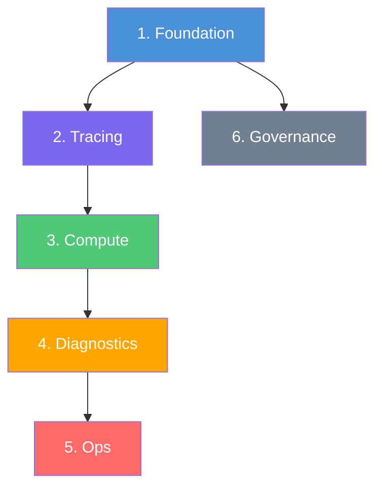

# Monitoring Golden Path - Module Structure

> **Strategy Reference**: This document defines the standard Bicep module structure for Azure App Services observability. Teams can replicate this structure for any workload.

## ✅ Strategy Checklist

| Requirement | Status | Implementation |
|-------------|--------|----------------|
| Workspace-based App Insights per component | ✅ | `modules/appinsights.bicep` - One per web/api/func |
| Standardized topology (1 RG, 1 LAW per env) | ✅ | `modules/foundation.bicep` - Creates RG + LAW |
| Platform logs via diagnostic settings | ✅ | `modules/diagnosticSettings-websites.bicep` |
| Clear "Golden Path" steps | ✅ | See deployment order below |
| Repeatable IaC structure | ✅ | This document |

---

## 📁 Standard Module Structure

```
Azure-Observability-Strategies/
│
├── main.bicep                          # Orchestrator (subscription-scoped)
├── parameters/
│   ├── dev.bicepparam                  # Dev environment parameters
│   └── prod.bicepparam                 # Prod environment parameters
│
└── modules/
    │
    │ ══════════════════════════════════════════════════════════════
    │ LAYER 1: FOUNDATION
    │ Purpose: Resource Group + Log Analytics Workspace
    │ Deploy: First (everything depends on this)
    │ ══════════════════════════════════════════════════════════════
    │
    ├── foundation.bicep                # RG + orchestrates LAW
    ├── logAnalyticsWorkspace.bicep     # LAW with retention settings
    │
    │ ══════════════════════════════════════════════════════════════
    │ LAYER 2: TRACING (Application Performance Monitoring)
    │ Purpose: Workspace-based App Insights per component
    │ Deploy: After Foundation
    │ ══════════════════════════════════════════════════════════════
    │
    ├── appinsights.bicep               # Reusable App Insights module
    │                                   # → appi-web-{workload}-{env}-{region}
    │                                   # → appi-api-{workload}-{env}-{region}
    │                                   # → appi-func-{workload}-{env}-{region}
    │
    │ ══════════════════════════════════════════════════════════════
    │ LAYER 3: COMPUTE (Application Resources)
    │ Purpose: App Service Plan + Web/API/Function Apps
    │ Deploy: After Tracing (needs App Insights connection strings)
    │ ══════════════════════════════════════════════════════════════
    │
    ├── compute.bicep                   # ASP + Web + API + Function + Storage
    │
    │ ══════════════════════════════════════════════════════════════
    │ LAYER 4: DIAGNOSTICS (Platform Logs)
    │ Purpose: Send App Service platform logs to LAW
    │ Deploy: After Compute (needs website resource IDs)
    │ ══════════════════════════════════════════════════════════════
    │
    ├── diagnosticSettings-websites.bicep  # Platform logs → LAW
    │                                      # ⚠️ May cause app restart
    │
    │ ══════════════════════════════════════════════════════════════
    │ LAYER 5: OPS (Alerting & Dashboards)
    │ Purpose: Alerts, Action Groups, Workbooks
    │ Deploy: After Diagnostics (optional, can be done later)
    │ ══════════════════════════════════════════════════════════════
    │
    ├── ops-alerting-workbooks.bicep    # Alerts + Workbook
    │
    │ ══════════════════════════════════════════════════════════════
    │ LAYER 6: GOVERNANCE (Security & Compliance)
    │ Purpose: RBAC, Policies, PII controls
    │ Deploy: Anytime after Foundation
    │ ══════════════════════════════════════════════════════════════
    │
    ├── policy-tags.bicep               # Tag enforcement policy definition
    ├── policy-assignment.bicep         # Policy assignment to RG
    └── security-observability.bicep    # RBAC (Monitoring Reader/Contributor)
```

---

## 🚀 Deployment Order (Golden Path)



### Step-by-Step Commands

```bash
# Set variables
ENV="dev"
LOCATION="westeurope"
WORKLOAD="obs-demo"

# Step 1: Deploy Foundation + Tracing + Governance (main.bicep)
az deployment sub create \
  --location $LOCATION \
  --template-file main.bicep \
  --parameters parameters/${ENV}.bicepparam

# Step 2: Deploy Compute (separate deployment)
az deployment group create \
  --resource-group rg-${WORKLOAD}-${ENV}-weu \
  --template-file modules/compute.bicep \
  --parameters @parameters/compute-${ENV}.json

# Step 3: Deploy Diagnostics (after compute)
az deployment group create \
  --resource-group rg-${WORKLOAD}-${ENV}-weu \
  --template-file modules/diagnosticSettings-websites.bicep \
  --parameters @parameters/diag-${ENV}.json

# Step 4 (Optional): Deploy Ops Layer
az deployment group create \
  --resource-group rg-${WORKLOAD}-${ENV}-weu \
  --template-file modules/ops-alerting-workbooks.bicep \
  --parameters @parameters/ops-${ENV}.json
```

---

## 📊 Data Flow Architecture

```
┌─────────────────────────────────────────────────────────────────────────────┐
│                              LAYER 3: COMPUTE                               │
├─────────────────────────────────────────────────────────────────────────────┤
│                                                                             │
│   ┌─────────────┐      ┌─────────────┐      ┌─────────────┐                │
│   │   Web App   │ ───► │   API App   │ ───► │  Function   │                │
│   │  (Razor/MVC)│      │  (REST API) │      │ (Isolated)  │                │
│   └──────┬──────┘      └──────┬──────┘      └──────┬──────┘                │
│          │                    │                    │                        │
└──────────┼────────────────────┼────────────────────┼────────────────────────┘
           │                    │                    │
           │ OpenTelemetry      │ OpenTelemetry      │ OpenTelemetry
           │ (OTLP/HTTP)        │ (OTLP/HTTP)        │ (OTLP/HTTP)
           ▼                    ▼                    ▼
┌─────────────────────────────────────────────────────────────────────────────┐
│                              LAYER 2: TRACING                               │
├─────────────────────────────────────────────────────────────────────────────┤
│                                                                             │
│   ┌─────────────────┐  ┌─────────────────┐  ┌─────────────────┐            │
│   │  appi-web-*     │  │  appi-api-*     │  │  appi-func-*    │            │
│   │  (App Insights) │  │  (App Insights) │  │  (App Insights) │            │
│   └────────┬────────┘  └────────┬────────┘  └────────┬────────┘            │
│            │                    │                    │                      │
│            └────────────────────┼────────────────────┘                      │
│                                 │ Workspace-based                           │
│                                 ▼                                           │
└─────────────────────────────────────────────────────────────────────────────┘
                                  │
┌─────────────────────────────────────────────────────────────────────────────┐
│                             LAYER 1: FOUNDATION                             │
├─────────────────────────────────────────────────────────────────────────────┤
│                                                                             │
│   ┌─────────────────────────────────────────────────────────────────────┐  │
│   │                    Log Analytics Workspace                          │  │
│   │                         law-*-{env}-{region}                        │  │
│   │  ┌──────────────┐  ┌──────────────┐  ┌──────────────┐              │  │
│   │  │ AppTraces    │  │ AppRequests  │  │ AppDependenc │              │  │
│   │  │ AppExceptions│  │ AppPageViews │  │ AppMetrics   │              │  │
│   │  └──────────────┘  └──────────────┘  └──────────────┘              │  │
│   │                                                                     │  │
│   │  ┌──────────────┐  ┌──────────────┐  ┌──────────────┐              │  │
│   │  │ AppSvcHTTP   │  │ AppSvcConsole│  │ AppSvcPlatfrm│  ◄── Diag    │  │
│   │  │ Logs         │  │ Logs         │  │ Logs         │     Settings │  │
│   │  └──────────────┘  └──────────────┘  └──────────────┘              │  │
│   └─────────────────────────────────────────────────────────────────────┘  │
│                                                                             │
└─────────────────────────────────────────────────────────────────────────────┘
```

---

## 🏷️ Naming Convention

| Resource Type | Pattern | Example |
|---------------|---------|---------|
| Resource Group | `rg-{workload}-{env}-{region}` | `rg-obs-demo-dev-weu` |
| Log Analytics | `law-{workload}-{env}-{region}` | `law-obs-demo-dev-weu` |
| App Insights | `appi-{component}-{workload}-{env}-{region}` | `appi-web-demo-dev-weu` |
| App Service Plan | `asp-{workload}-{env}-{region}` | `asp-obs-demo-dev-weu` |
| Web App | `web-{workload}-{env}-{region}` | `web-obs-demo-dev-weu` |
| API App | `api-{workload}-{env}-{region}` | `api-obs-demo-dev-weu` |
| Function App | `func-{workload}-{env}-{region}` | `func-obs-demo-dev-weu` |
| Alert Rule | `alrt-{env}-{workload}-{component}-{signal}` | `alrt-prod-demo-web-5xx` |
| Action Group | `ag-mon-{env}-{workload}` | `ag-mon-prod-demo` |
| Workbook | `wb-ops-{env}-{workload}` | `wb-ops-prod-demo` |

---

## 🔄 Module Reusability

Each module is designed to be:

1. **Self-contained**: Can be deployed independently
2. **Parameterized**: No hardcoded values
3. **Idempotent**: Safe to redeploy
4. **Documented**: Clear header comments with usage examples

### Example: Adding a New Component

To add a 4th component (e.g., a background worker):

```bicep
// In main.bicep - add another App Insights instance
module appInsightsWorker 'modules/appinsights.bicep' = {
  name: 'appinsights-worker-${env}-${workload}'
  scope: resourceGroup(resourceGroupName)
  params: {
    appInsightsName: 'appi-worker-${workloadSuffix}-${env}-${locationSuffix}'
    location: location
    logAnalyticsWorkspaceId: foundation.outputs.logAnalyticsWorkspaceId
    applicationType: 'web'
    tags: requiredTags
  }
}
```

---

## 📋 Environment Comparison

| Setting | Dev | Prod |
|---------|-----|------|
| LAW Retention | 30 days | 90+ days |
| Alert Severity | Warning (2) | Error (1) |
| Tag Policy Effect | Audit | Deny |
| Sampling Rate | 100% | 10-50% |
| Availability Tests | Optional | Required |
| RBAC | Relaxed | Strict |

---

## 📚 Related Documentation

- [.docs/1-redesign-monitoring.md](.docs/1-redesign-monitoring.md) - Strategy requirements
- [.docs/2-compute-resources.md](.docs/2-compute-resources.md) - Compute layer spec
- [.docs/3-diagnostic-settings.md](.docs/3-diagnostic-settings.md) - Diagnostics config
- [.docs/4-deploy-demo-apps.md](.docs/4-deploy-demo-apps.md) - Demo app deployment
- [.docs/5-governance.md](.docs/5-governance.md) - RBAC & policies
